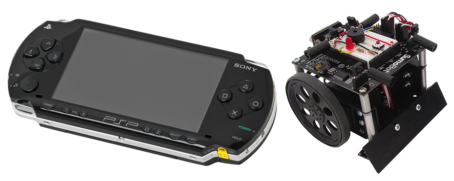

# PSP-Robot

*Parallax Sumobot Remote Controlled by Playstation Portable 1000*

## How to use
### The robot
- Just build a standard(2008) Parallax Sumobot with a basic stamp 2, then program it with the bs2 code provided in this repo.
- Connect an IR-receiver on pin ?(see code).

#### Enhanced receiver
You can connect multiple IR-recievers in serial to be able to receive the IR-signals from multiple directions. Otherwise you might loose control when the robot turns.

You may be able to use a lens to achieve the same results.

### The Playstation Portable
#### Prereqs

- PSP model 1000, (with IR-port)
- PSP installed with CFW able to run homebrew.

#### Installation
#### Controls

- Cross - Move forwards
	- + Left/Right - Move Forwards and turn
- Circle
- Square
- Triangle
- L
- R
- DPad Left - Turn Left
- DPad Right - Turn Right
- DPad Up
- DPad Down

## How to install
Just put the psp-executable folder in /PSP/GAME150  or /PSP/GAME of your system.

## For developers
Compiled on windows using psptoolkit2.x.